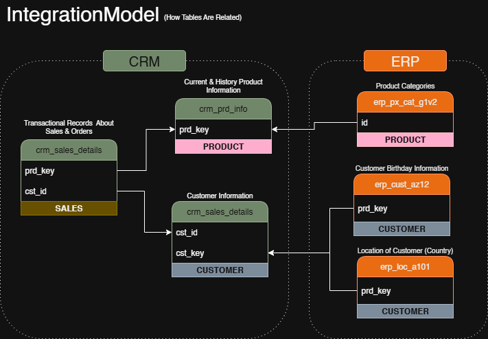

# 💼 Modern Data Warehouse Project – Sales Data Analytics with SQL Server

This project showcases the complete development of a **Modern Data Warehouse** using **SQL Server**, designed to integrate and consolidate ERP and CRM data for advanced sales analytics, business reporting, and strategic decision-making.

---

## 📌 Project Overview

- **Architecture**: Layered Data Warehouse (Bronze, Silver, Gold) following Medallion best practices.
- **Tech Stack**: SQL Server Express, SSMS, GitHub, Notion, Draw.io.
- **Pipeline**: End-to-end ETL/ELT workflow from raw CSV files to business-ready data.
- **Modeling**: Star schema with dimensional modeling and surrogate keys.
- **Use Case**: Integration of structured ERP and CRM data to enable clean, reliable, and actionable sales insights.

---

## 🗺️ Data Flow Diagram

This diagram illustrates the movement of data across layers, from raw ingestion to business consumption. It also shows how CRM and ERP sources contribute to the dimensional model.

---

## 🧱 Architecture

A modern Medallion architecture was implemented:

### 🔹 Bronze Layer
- **Purpose**: Store raw data exactly as received.
- **Data Type**: Physical tables
- **Load Type**: `TRUNCATE + INSERT` (Full Load)
- **Notes**: No transformations applied.

### 🔸 Silver Layer
- **Purpose**: Clean, standardize, and normalize data.
- **Transformations**:
  - Whitespace cleanup
  - Deduplication with `ROW_NUMBER()`
  - Null/default value handling
  - Data enrichment via joins
- **Stored Procedure**: `load_silver`

### 🟡 Gold Layer
- **Purpose**: Serve business-ready data for consumption.
- **Object Type**: SQL Views (not physical tables)
- **Features**:
  - Dimensional modeling (Star Schema)
  - Surrogate keys using `ROW_NUMBER()`
  - Aggregation-ready structure

---

## 🧩 Integration Model

This diagram shows how CRM and ERP systems are integrated via common keys, contributing to the construction of the dimension and fact views in the gold layer.

---

## ⭐ Star Schema

Final schema presented in the Gold Layer:

- **Dimensions**:
  - `dim_customers`
  - `dim_products`
- **Fact Table**:
  - `fact_sales` (linked by surrogate keys)

This structure supports BI tools and high-performance analytical queries.

---

## 🚀 ETL Process Breakdown

1. **Source Ingestion** (ERP & CRM CSVs)
   - Loaded into Bronze using `BULK INSERT`

2. **Transformation (Silver Layer)**:
   - Standardization, cleaning, and type conversions
   - Enrichment using ERP metadata
   - Managed via `silver.load_silver` procedure

3. **Business-Ready Views (Gold Layer)**:
   - Views created using `LEFT JOIN`, `CASE`, `ROW_NUMBER`
   - Filters to remove historical data (e.g., inactive products)

---

## 🔧 Technologies Used

- **SQL Server Express**
- **SQL Server Management Studio (SSMS)**
- **GitHub** – version control
- **Draw.io** – for diagrams
- **Notion** – for agile planning and documentation
- **CSV Files** – ERP & CRM raw data

---

## 📘 Concepts & Techniques Applied

- **ETL vs. ELT Design**
- **Medallion Architecture (Bronze → Silver → Gold)**
- **Data Modeling** (Star Schema)
- **Surrogate Keys**
- **Data Cleansing & Standardization**
- **SQL Views for Business Consumption**
- **Batch Load Strategy**
- **Ad-Hoc Query Optimization**

---

## 🗂️ Documentation & Lineage

- All scripts (`DDL`, `Stored Procedures`, `Views`) are versioned in this repository.
- A full **data catalog** describes the `gold` layer schema with columns, types, and descriptions.
- Lineage is visualized via diagrams and query joins across layers.

---

## ✅ Final Deliverables

- Functional Data Warehouse built from raw ERP/CRM sources
- Cleaned, integrated sales data in Gold Layer views
- Fully documented ETL process and lineage
- Star Schema ready for Power BI, SQL reporting, and ML consumption

---

## 📈 Next Steps (Future Enhancements)

- Implement Slowly Changing Dimensions (SCD Type 2)
- Add snapshot tables to gold layer for historical analysis
- Schedule ETL via SQL Agent
- Add monitoring and logging for data quality checks